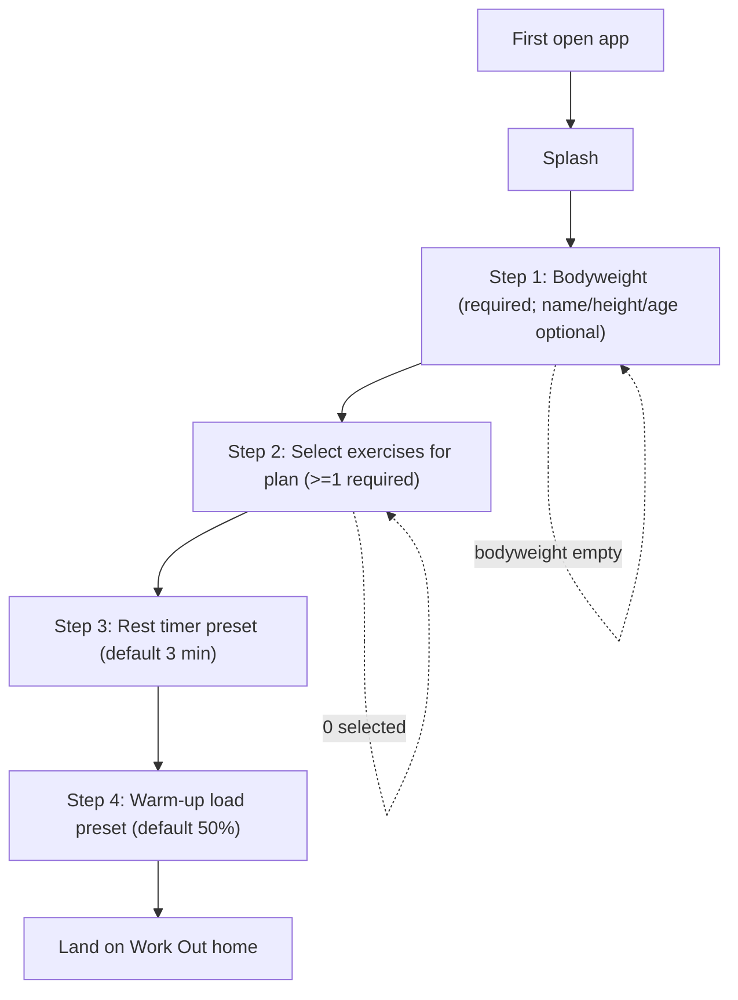
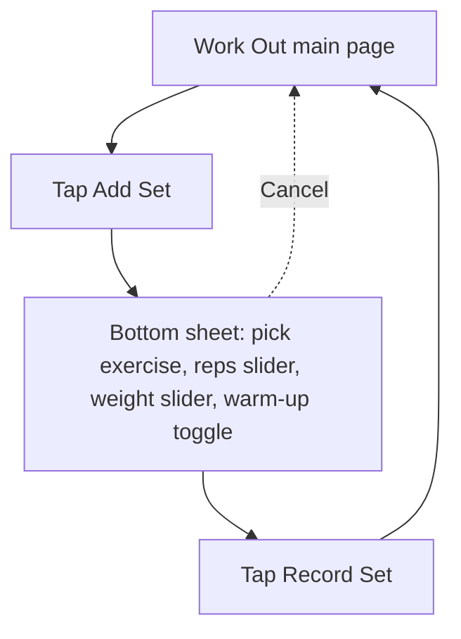
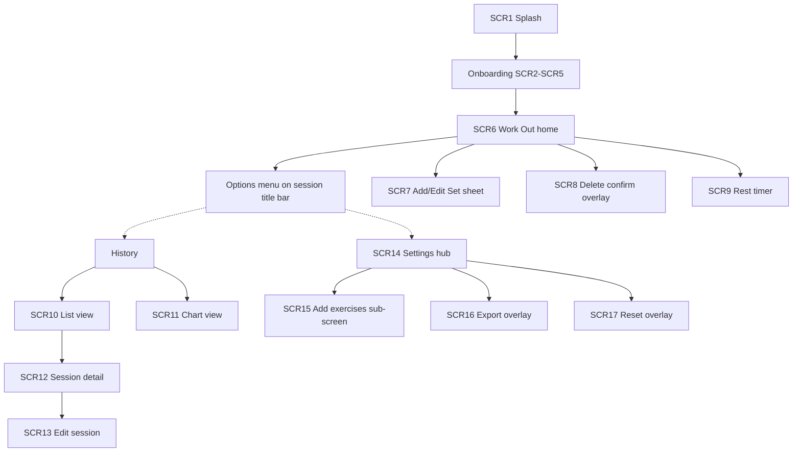
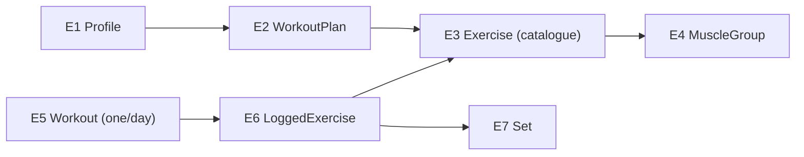
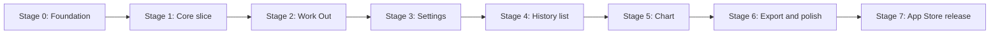

# Application Blueprint: UltraLoad

> Platform-neutral spec: everything required to design, build, test, and maintain this application.

## 1. Product Overview

UltraLoad is a personal, offline strength-training app that logs ad-hoc gym sessions with almost no friction **in daily use**, then shows whether you're getting stronger over time. First launch is a one-time 4-step setup (bodyweight → exercises → rest → warm-up); steps 3–4 are pre-filled so most users tap through quickly. Day-to-day logging is minimal: tap Add Set, slide, record. It's built for one experienced lifter (the creator is the sole user) who trains intuitively, picks familiar exercises, and judges progress over months rather than single sessions. The app stays out of the way during sets — a rest timer is the only in-gym assist — and measures progress by **total weight moved** (Σ weight × reps for non-warm-up "standard" sets).

**Shape of the app:** a single **Work Out home** screen (default after onboarding). **History** and **Settings** are reached via an **options menu** on the session title bar — no bottom tab bar. The workout model is a "notepad": there is no "start workout" button; the first set logged on a calendar day creates that day's record. There are no training splits — one flat workout plan of exercises chosen at onboarding and editable in Settings.

**Platform & distribution:** React Native (Expo) + TypeScript, iOS + Android, 100% offline and local-only (no login, no cloud sync). **iOS ships to the public App Store** as a normal installable app (not a personal sideload or TestFlight-only build) — solo-user product, but through Apple's full release process so the creator learns store submission end-to-end. **Android:** APK sideload or Google Play (TBD at release; iOS App Store is the v1 store-release target). Dark mode only, Geist font, Figma variables as the design source.

**MVP boundary:** logging, history (list + chart), progress math, settings, units, export/import, reset, **iOS App Store release**. **Out of scope / future:** 8RM estimates, rep-budget targets, stall detection, multi-user, cloud sync.

## Traceability

| ID | Type | Name | Links |
|----|------|------|-------|
| F1 | Feature | Notepad set logging | FL2, SCR6, SCR7 |
| F2 | Feature | First-launch onboarding | FL1, SCR1–SCR5 |
| F3 | Feature | Catalogue + workout plan management | FL8, SCR3, SCR14, SCR15 |
| F4 | Feature | Warm-up auto-tag + override | FL2, SCR7 |
| F5 | Feature | Rest timer | FL4, SCR9 |
| F6 | Feature | History list (totals + % change) | FL5, SCR10 |
| F7 | Feature | Session detail (view + edit) | FL6, SCR12, SCR13 |
| F8 | Feature | History chart (filters + ranges) | FL7, SCR11 |
| F9 | Feature | Progress measurement math | FL5, FL6, FL7 |
| F10 | Feature | Settings hub | FL8, FL9, FL10, FL11, FL12, SCR14, SCR15 |
| F11 | Feature | Unit system (kg/lbs/stone) | FL12, SCR14 |
| F12 | Feature | Export data (JSON) | FL9, SCR16 |
| F13 | Feature | Import data (JSON) | FL10, SCR14 |
| F14 | Feature | Reset profile | FL11, SCR17 |
| F15 | Feature | Splash screen | FL1, SCR1 |
| F16 | Feature | Bodyweight-exercise total-weight handling | FL2, SCR7, SCR14 |

## 2. Feature Requirements

<!-- F* IDs for MVP features; future/non-goals listed separately -->

**MVP features**

| ID | Feature | Summary |
|----|---------|---------|
| F1 | Notepad set logging | Add/edit/delete sets via a bottom sheet; sets group under their exercise automatically. No "start workout" — first set of the day creates the record (BR1). |
| F2 | First-launch onboarding | Splash → bodyweight (required) → exercise picker (≥1) → rest timer preset → warm-up preset → Work Out. Replayed on reset. |
| F3 | Catalogue + workout plan | 25 built-in exercises (E3); flat ordered plan chosen at onboarding, editable in Settings. Only plan exercises are visible (BR2); removal hides history until re-enabled (BR3), with confirmation bottom sheet (FL8). |
| F4 | Warm-up auto-tag + override | Sets at weight ≤ history-derived threshold auto-tag as warm-up (BR4, BR15); toggle always visible; manual override applies to one set only (BR5). |
| F5 | Rest timer | Optional, user-triggered, global range 3 s – 5 min (BR20); background notification when app is backgrounded. |
| F6 | History list | Per-day rows: day total weight + day % change, or "—" when no comparison (BR7, BR9, BR10). |
| F7 | Session detail | Read-only by default; top-right edit enters editable mode reusing the logging bottom sheet; edits recalc downstream (BR12). |
| F8 | History chart | Y = session/exercise/muscle-group total; X = date; exercise + muscle-group filters; ranges month/year/all-time; 10 latest visible, horizontal scroll. |
| F9 | Progress measurement | Total weight moved, % change, day averaging, muscle-group weighting (BR6–BR13). |
| F10 | Settings hub | Bodyweight, plan editing, warm-up %, per-exercise range/increment/warm-up % (**22 non-bodyweight exercises only**; ◊ exercises follow BR18/BR26), rest preset, units, export, reset. |
| F11 | Unit system | Display in kg/lbs/stone uniformly; storage always kg; convert rounded to 0.5 (BR17). |
| F12 | Export data | JSON snapshot via share sheet. |
| F13 | Import data | JSON via document picker from Settings (UI finalized during build). |
| F14 | Reset profile | Confirmation overlay → full wipe → onboarding replay (BR24). |
| F15 | Splash | Branded loading moment on launch. |
| F16 | Bodyweight-exercise handling | Dip, weighted pull-up, glute bridge curl sliders show total weight; ranges recalc immediately on bodyweight change (BR18). |

**Future / non-goals (explicit):** 8RM estimates · rep-budget targets (internal philosophy only, never shown) · stall detection · multi-user · cloud sync/login · per-exercise rest timers · exercise renaming · free-text exercises · female strength standards.

## 3. User Flows

<!-- FL* IDs; mermaid; happy + failure paths -->

### FL1 — First-launch onboarding (F2, F15)



- Steps 3–4 cannot be skipped but are pre-filled; user may tap Next without changes. Nothing pre-selected in the exercise picker. Reset replays the full journey (no partial wizard).

### FL2 — Log a set (F1, F4, F16)



- Defaults: last set's values for the same exercise today, else slider minimum (BR21). Warm-up auto-tags per BR4 (◊ exercises: total weight vs BR26; others: weight vs history-derived threshold per BR15); manual override lasts one set (BR5).

### FL3 — Edit / delete a set (F1)
**Work Out (SCR6):** tap a logged set row → SCR7 opens in **edit mode** with that set's values (per Figma "edit a set"). **History (SCR12/SCR13):** same bottom sheet in edit mode. Change values → Record, or Delete (confirmation overlay per Figma). Editing recalculates affected totals/% (BR12).

### FL4 — Rest timer (F5)
User taps the timer on the Work Out main page → timer runs (range 3 s–5 min). Backgrounding the app fires a notification alert. Never auto-starts after recording a set.

### FL5 — View history list (F6, F9)
Work Out home → options menu → History → List view → rows per day with day total + day % change (or "—"). Empty state shown when no data (shared list/chart empty state per Figma).

### FL6 — View / edit a session (F7)
Tap a day → session detail (read-only, grouped exercise → sets) → top-right edit → editable mode → edit/delete via bottom sheet → downstream % recalculated (BR12).

### FL7 — Chart + filter (F8, F9)
Work Out home → options menu → History → Chart view → default Y = session total, 10 latest visible. Filter by exercise (Y switches to that exercise) or by muscle group (weighted calc, BR13). Time range month/year/all-time; horizontal scroll along timeline.

### FL8 — Edit workout plan (F3)
Settings → Edit workout plan → add-exercises sub-screen → toggle exercise **off** → **confirmation bottom sheet** (same pattern as set delete): *"This exercise will be hidden from your workout and History until you add it back. Your past sets are kept."* → Confirm hides exercise + history (BR3); Cancel leaves plan unchanged. Toggle **on** re-enables immediately (no confirmation).

### FL9 — Export data (F12)
Settings → Export → overlay alert → JSON snapshot to share sheet (Save to Files, AirDrop, etc.).

### FL10 — Import data (F13)
Settings → Import → document picker → **validate** JSON (`schemaVersion`, required fields, exercise ids exist in catalogue) → **confirmation overlay** ("Replace all data? This cannot be undone.") → on confirm, wipe SQLite and restore from file → on success, hydrate store and land on Work Out. **Failure paths:** malformed JSON, unsupported `schemaVersion`, or unknown exercise ids → show error overlay; existing data unchanged.

### FL11 — Reset profile (F14)
Settings → Reset → confirmation overlay → full wipe → onboarding replay (FL1).

### FL12 — Change unit system (F10, F11)
Settings (SCR14) → unit selector (kg/lbs/stone) → all displayed weights re-render uniformly from kg storage, rounded to nearest 0.5 (BR17). Storage stays kg.

## 4. Information Architecture

<!-- SCR* IDs; sitemap; hierarchy -->



| ID | Screen | Context | Why the user sees it |
|----|--------|---------|----------------------|
| SCR1 | Splash | Launch | Branded loading moment |
| SCR2 | Profile setup — bodyweight | Onboarding | Set required bodyweight (+ optional name/height/age) |
| SCR3 | Profile setup — exercise picker | Onboarding | Choose workout-plan exercises (≥1) |
| SCR4 | Profile setup — rest timer | Onboarding | Set default rest preset (default 3 min) |
| SCR5 | Profile setup — warm-up preset | Onboarding | Set default warm-up load % (default 50%) |
| SCR6 | Work Out main page | Home | Log/view today's sets grouped by exercise |
| SCR7 | Add/Edit Set bottom sheet | Home + History | Pick exercise, reps/weight sliders, warm-up toggle |
| SCR8 | Delete confirmation overlay | Home + History | Confirm set deletion |
| SCR9 | Rest timer | Home | Optional rest countdown |
| SCR10 | History — list | History | Per-day totals + % change |
| SCR11 | History — chart | History | Progress over time with filters |
| SCR12 | Session detail (read-only) | History | Review a past day's sets |
| SCR13 | Edit session | History | Edit a past day's sets |
| SCR14 | Settings hub | Settings | Profile, plan, presets, units, export, reset |
| SCR15 | Add exercises sub-screen | Settings | Add/remove plan exercises (only pushed sub-screen) |
| SCR16 | Export data overlay | Settings | Trigger export |
| SCR17 | Reset profile overlay | Settings | Confirm full wipe |

Note (per Figma): export/reset are overlay alerts on Settings, not pushed screens. Labels outside phone frames in Figma are flow annotations, not screens.

## 5. Data Model

<!-- E* IDs; entities, attributes, relationships -->



| ID | Entity | Key attributes | Notes |
|----|--------|----------------|-------|
| E1 | Profile | bodyweight (kg, required), name/height/age (optional), units (kg/lbs/stone), warmUpPercent, warmUpAutoTagEnabled (bool, default true), restTimerSeconds | Single user. Display unit is a profile setting; storage always kg. |
| E2 | WorkoutPlan | ordered list of exerciseIds | Flat, catalogue order (grouped by muscle group); no split entities. |
| E3 | Exercise | id (immutable slug), name, primaryMuscle, type (Compound/Isolation, reference only), sliderRange, increment, muscleMultipliers, isBodyweight, deprecated (optional, default false) | Built-in catalogue only (BR28–BR31); seeded from editable data module, not user-created. Display name editable in seed file; id never changes (BR29). Cannot rename or free-text in-app. Warm-up thresholds are runtime-derived from logged history (BR15), not catalogue fields. |
| E4 | MuscleGroup | name, multiplier (per exercise) | Chest/Shoulders/Back/Glutes/Quads filterable; Biceps/Triceps only in multipliers. |
| E5 | Workout | date (one per calendar day), loggedExercises | Created by first set of the day (BR1). |
| E6 | LoggedExercise | exerciseId, sets, order (first logged) | Group order = first exercise logged that day. |
| E7 | Set | weight (kg), reps, warmUp (bool), order, timestamp | **Weight semantics:** for the 3 bodyweight exercises (◊), `weight` stores **total weight** (bodyweight + added; added may be negative). For all other exercises, `weight` stores **external load only**. Reps via sliders. Warm-up excluded from progress. |

All weights stored in kg internally. Removal from plan hides exercise + history until re-enabled (BR3).

## 6. Business Rules

<!-- BR* IDs; validation, calculation, constraints -->

| ID | Rule |
|----|------|
| BR1 | One workout record per calendar day; first set of the day creates it. |
| BR2 | Only exercises in the active workout plan appear in lists, filters, pickers (Work Out + History). |
| BR3 | Removing an exercise hides it and its history; re-enabling restores exercise and full history. |
| BR4 | A set auto-tags as warm-up when weight ≤ warm-up threshold; warm-up sets are excluded from progress math. For the 3 bodyweight exercises (◊), **weight** means **total weight** per BR18 and threshold per BR26; for all other exercises, **weight** is external load compared to the runtime threshold derived from BR15. |
| BR5 | Manual warm-up toggle override applies to one set only; the next set reverts to auto-tagging. |
| BR6 | Per exercise per day, **total weight moved** = Σ(weight × reps) over standard (non-warm-up) sets only. |
| BR7 | Day total weight = sum of total weight moved across all exercises that day, standard sets only. |
| BR8 | Per-exercise % change compares against the previous session that included the same exercise (standard sets); computed only when a valid prior session exists. For ◊ exercises, compares **total weight** (bodyweight + added) — bodyweight changes are intentional progress signal. |
| BR9 | Day % change = **simple average** of per-exercise % changes for that day, including only exercises with a valid comparison. Each exercise counts equally (not volume-weighted); day % may diverge from day total direction — intentional. |
| BR10 | Show "—" when there is no valid prior session / nothing valid to compare. |
| BR11 | Warm-up-only sessions draw no comparison; later standard sets cannot compare against prior warm-up sets. |
| BR12 | Editing a past day recalculates all downstream % changes. |
| BR13 | Muscle-group chart value = Σ over exercises of (total weight moved × that muscle's multiplier); exercises with no multiplier for the group are skipped. |
| BR14 | Slider range = Beginner rounded down to nearest 10 → Elite rounded up to nearest 10 (from 75 kg reference standards). Applies to the 22 non-bodyweight exercises only (see BR18). |
| BR15 | Warm-up threshold = `warmUpPercent / 100 × referenceWeight`, where `referenceWeight` is the heaviest **standard** (non-warm-up) set weight logged for that exercise at the best available rep count: prefer **6 reps**, else **7**, **8**, **9**, … Warm-up sets are never used when finding the reference. Default `warmUpPercent` = 50; adjustable 10–70% in onboarding/Settings. **No strength standards or catalogue thresholds.** If no qualifying history exists, no auto-tag (manual toggle still available). **U1 interim (Stage 1):** until full history rep-max lookup ships in Stage 2, non-◊ auto-tag uses **today's most recent standard set** for the same exercise as `referenceWeight`. No auto-tag until that exists. |
| BR16 | Increments by equipment: barbell 5 kg, dumbbell 2.5 kg, cable/machine/bodyweight 1 kg; overridable per exercise to 1 / 2.5 / 5 kg. |
| BR17 | All weights stored in kg; display in kg/lbs/stone uniformly; unit conversion rounded to nearest 0.5. |
| BR18 | The 3 bodyweight exercises (Dip (weighted), Weighted pull-ups, Gluteus bridge curl) show **total weight** (current bodyweight + added; added may be negative = assisted). Slider range = **[0.5× current bodyweight, 2× current bodyweight]**, recomputed **live** whenever bodyweight changes in Settings (no restart). Increment = 1 kg. This supersedes the old fixed strength-standard ranges and the 75 kg reference for these three; the 75 kg standard (BR14, BR25) drives only the other 22 exercises. |
| BR19 | Crossover slider min = 10 kg (not 0). |
| BR26 | Warm-up auto-tag for the 3 bodyweight exercises: any set whose **total weight ≤ current bodyweight** is a warm-up (threshold = current bodyweight, scales live with bodyweight). This supersedes the old tabulated thresholds (Dip 62, pull-up 55) and the old "glute bridge curl = no auto warm-up" note — all three now warm-up at total ≤ bodyweight. |
| BR20 | Rest timer is global, range 3 s – 5 min, no per-exercise overrides; never auto-starts. |
| BR21 | Default reps/weight = last set's values for the same exercise today, else slider minimum. |
| BR22 | Reps and weight input via sliders only — no steppers, number pads, or preset chips. |
| BR23 | Chart muscle-group filters limited to Chest, Shoulders, Back, Glutes, Quads (not Biceps/Triceps). |
| BR24 | Reset = full wipe + onboarding replay. |
| BR25 | 75 kg reference bodyweight is used only to derive ranges for the 22 non-bodyweight exercises; it does not scale with the user's actual bodyweight over time and does not affect the 3 bodyweight exercises (BR18). |
| BR27 | **Global warm-up auto-tag** (`warmUpAutoTagEnabled`, default on): when **on**, BR4/BR26 auto-tagging applies. When **off**, no set is auto-tagged; the warm-up toggle remains visible on every set and the user may still mark a set warm-up manually (manual warm-up sets remain excluded from progress per BR6). Per-set override (BR5) applies only when auto-tag is on. |
| BR28 | **Catalogue is editable seed data**, not scattered constants. The built-in exercise list and muscle-group multipliers live in **one dedicated data module** (e.g. `src/data/exercise-catalogue.ts`). The app reads catalogue fields to decide which exercises appear in pickers, which sliders/toggles to show, default ranges, increments, and chart muscle-group math. Warm-up thresholds are derived at runtime from history (BR15), not catalogue fields. **No exercise names, ranges, or multipliers hardcoded in UI components.** The table in this blueprint is the v1 starting point; Pablo may refine it after further research. |
| BR29 | **Catalogue edit rules (id vs metadata).** Each exercise has an immutable `id` slug (e.g. `bench-press`). Workouts, the plan, settings overrides, and export JSON all reference exercises **by id only** — never by display name. **Safe to edit in the seed file (no UI code changes):** display `name`, `primaryMuscle`, ranges, increments, `muscleMultipliers`, `isBodyweight`, and other metadata fields. **Safe to add:** new exercises with new unique ids. **Never rename or delete an `id`** that existing workout history may reference — v1 has no id-migration tooling. To retire an exercise from future use, set `deprecated: true` in the catalogue (BR30). **Plan removal (BR3)** is separate: toggling off in Settings hides an exercise from the app; the catalogue row remains. |
| BR30 | **Deprecated catalogue entries.** An exercise with `deprecated: true` is excluded from onboarding and the add-exercises picker; it cannot be newly added to the plan. If already in the plan or in workout history, it continues to resolve name, ranges, and multipliers from the catalogue. Deprecated entries are never hard-deleted from the seed file while history may reference them. |
| BR31 | **Orphaned exercise ids.** If workout history references an `exerciseId` missing from the catalogue (e.g. seed row was incorrectly deleted), the app must not crash. History and session detail show those sets grouped under a fallback label (the raw id, or "Unknown exercise"); sets remain read-only. The id cannot be selected for new logging; it is excluded from chart filters and progress comparisons involving catalogue metadata. |

> **v1 snapshot — not frozen.** This table documents the initial seed data. The live source of truth at build time is the catalogue data module (BR28). Pablo will refine exercises, ranges, and multipliers as research continues; the app must surface whatever the catalogue defines without code changes outside that file.
>
> **What you can change safely** (BR29): display names, ranges, increments, muscle multipliers, muscle group, bodyweight flag. **What you cannot change without breaking history:** the `id` slug. **To stop offering an exercise:** set `deprecated: true` — do not delete the row. **To hide from your app without retiring globally:** remove from your workout plan (BR3).

| Exercise | Muscle | Slider range (kg) | Incr. | BW◊ |
|----------|--------|-------------------|-------|-----|
| Bench press | Chest | 30–150 | 5 | |
| Dip (weighted) | Chest | total wt; 0.5×–2× bodyweight (live) | 1 | ◊ |
| Crossover | Chest | 10–110 (min 10) | 1 | |
| 30° incline bench press | Chest | 30–140 | 5 | |
| Overhead press | Shoulders | 20–110 | 5 | |
| Z press | Shoulders | 20–90 | 5 | |
| Modified Bradford press | Shoulders | 10–80 | 5 | |
| Weighted pull-ups | Back | total wt; 0.5×–2× bodyweight (live) | 1 | ◊ |
| Rows | Back | 30–140 | 5 | |
| Meadows row | Back | 10–70 | 5 | |
| High-cable row | Back | 30–120 | 1 | |
| Lat pulldown | Back | 30–140 | 1 | |
| Dead row | Back | 40–150 | 5 | |
| Barbell hip thrust | Glutes | 30–270 | 5 | |
| Cable pull through | Glutes | 10–140 | 1 | |
| Dumbbell leaning step up | Glutes | 10–110 | 2.5 | |
| Gluteus bridge curl | Glutes | total wt; 0.5×–2× bodyweight (live) | 1 | ◊ |
| Romanian deadlifts | Glutes | 50–210 | 5 | |
| Low bar squats | Glutes | 60–230 | 5 | |
| Front squat | Quads | 50–170 | 5 | |
| Belt squat | Quads | 50–190 | 2.5 | |
| Hack squat | Quads | 50–300 | 2.5 | |
| Bulgarian split squat | Quads | 10–140 | 5 | |
| High bar back squat | Quads | 50–210 | 5 | |
| Reverse lunge | Quads | 30–150 | 5 | |

◊ = bodyweight-based (slider shows total weight; ranges update when bodyweight changes). Non-◊ warm-up thresholds are computed at runtime from logged history + `warmUpPercent` (BR15), not seeded in the catalogue. "Squats" in older docs = High bar back squat. Meadows row has no "per arm" label. Primary muscle column is catalogue organisation only — progress calc uses multipliers below.

### Muscle-group multipliers (calculation only; not shown in UI)

> Stored per exercise in the catalogue seed module (BR28), not a separate hardcoded table.

| Exercise | Multipliers |
|----------|-------------|
| Overhead press | 1× Shoulders, 0.5× Triceps, 0.2× Chest |
| Z press | 1× Shoulders, 0.5× Triceps |
| Modified Bradford press | 1× Shoulders, 0.33× Triceps |
| Bench press | 1× Chest, 0.5× Triceps, 0.33× Shoulders |
| Dip (weighted) | 1× Chest, 0.5× Triceps, 0.33× Shoulders |
| Crossover | 1× Chest |
| 30° incline bench press | 1× Chest, 0.5× Shoulders, 0.33× Triceps |
| Weighted pull-ups | 1× Back, 0.5× Biceps |
| Rows | 1× Back, 0.5× Biceps |
| Meadows row | 1× Back, 0.5× Biceps |
| High-cable row | 1× Back, 0.33× Biceps |
| Lat pulldown | 1× Back, 0.5× Biceps |
| Dead row | 1× Back, 0.5× Glutes, 0.33× Biceps |
| Barbell hip thrust | 1× Glutes, 0.2× Quads |
| Cable pull through | 1× Glutes |
| Dumbbell leaning step up | 1× Glutes, 0.66× Quads |
| Gluteus bridge curl | 1× Glutes |
| Romanian deadlifts | 1× Glutes, 0.33× Back |
| Low bar squats | 1× Glutes, 0.66× Quads, 0.2× Back |
| Front squat | 1× Quads, 0.5× Glutes |
| Belt squat | 1× Quads, 0.5× Glutes |
| Hack squat | 1× Quads, 0.5× Glutes |
| Bulgarian split squat | 1× Quads, 0.66× Glutes |
| High bar back squat | 1× Quads, 0.66× Glutes, 0.2× Back |
| Reverse lunge | 1× Quads, 0.66× Glutes |

**Worked example (Glutes filter):** Bench 2000 kg (no Glutes → skip) + RDL 3000 kg (1× Glutes) + Hip thrust 4000 kg (1× Glutes) → 3000 + 4000 = **7000**.

## 7. State Management

**SQLite (via Drizzle) is the single source of truth.** Zustand holds UI/session state plus a hydrated, **write-through cache** of the hot domain data.

**Write-through model:** every mutation writes to SQLite **synchronously first**, then updates the store. On app launch, the store is **hydrated from SQLite**. The store is never authoritative on its own — it mirrors the database.

**Store slices:**

| Slice | Holds | Persisted? |
|-------|-------|-----------|
| `profileSlice` | bodyweight, optional name/height/age, units, warm-up %, warmUpAutoTagEnabled, rest preset | SQLite (write-through) |
| `planSlice` | active ordered workout plan (exercise ids) | SQLite (write-through) |
| `todaySlice` | today's workout (logged exercises + sets) | SQLite (write-through) |
| `settingsSlice` | per-exercise overrides (range/increment/warm-up %) for **non-bodyweight exercises only**; global warm-up on/off | SQLite (write-through) |
| `timerSlice` | running rest-timer countdown | **Transient** (memory only) |

**Transient (never persisted):** the rest-timer countdown, the open bottom-sheet draft (in-progress set — Cancel discards, Record commits via write-through, creating the day's workout if first set, BR1), and the current History filter/range selection.

- Editing recalculates derived progress values reactively so downstream % changes update (BR12).
- Bodyweight changes propagate immediately to the 3 bodyweight-exercise slider ranges and warm-up thresholds without restart (BR18, BR26).
- Unit changes re-render all displayed weights uniformly from kg storage (BR17).

## 8. Architecture Overview

- Single offline React Native (Expo) app; no backend, no network calls.
- Layers: **UI (screens + shared components)** → **domain/logic (progress math, warm-up tagging, unit conversion, range derivation)** → **persistence (SQLite via Drizzle ORM)**.
- **Catalogue layer (BR28–BR31):** one editable seed-data file drives exercise pickers, slider bounds, warm-up behaviour, Settings overrides eligibility (◊ vs non-◊), and muscle-group chart filters. UI and domain logic consume catalogue by `exerciseId` — never duplicate exercise metadata in components. Ids are immutable; deprecated entries stay in the file for history resolution.
- Built in **layers + vertical slices**, not tab-by-tab: shared UI (bottom sheet, sliders, log rows) built once and reused across Work Out and History; exercise picker shared by onboarding and Settings (see §18).
- Export/import is a JSON snapshot for manual transport between devices/versions.

## 9. Technology Stack

| Layer | Choice |
|-------|--------|
| Framework | Expo + TypeScript (iOS + Android) |
| Database | SQLite on device (Expo SQLite + Drizzle ORM) |
| Exercise catalogue | TypeScript seed module (`src/data/exercise-catalogue.ts` or equivalent) — single file, easy to edit; includes muscle multipliers per exercise and optional `deprecated` flag (BR28–BR30) |
| State | Zustand |
| Navigation | React Navigation (native stack; no bottom tabs) |
| Charts | react-native-gifted-charts (Expo Go compatible) |
| Export/import | JSON snapshot; `expo-document-picker` for import; share sheet for export |
| Design source | Figma (Geist font, dark theme, Figma variables) |
| Dev flow | Expo Go for early screens; dev build when native modules needed (charts, notifications) |
| Distribution | **iOS:** EAS Build + EAS Submit → **App Store** (Apple Developer Program, $99/yr). Production listing; installs and updates like any other app — no manual re-sign cycle. **Android:** APK sideload during development; Google Play optional at release. **No app-code changes required until Stage 7** — release is tooling, Apple accounts, and store metadata. |

## 10. UI Specifications

> **Build-time token contract (complete at blueprint level).** Component set, screen inventory, navigation, and interaction **intent** are specified here. Exact Figma token values (color / spacing / type scale) and per-component states/variants are **not invented here** — they are pulled and verified **1:1 via the Figma MCP during Stage 0** of the build. Motion/transitions match Figma defaults; there are no custom motion specs in v1.

**Accessibility (v1):** match Figma exactly and respect the system **dynamic text scaling** setting. Full accessibility (screen-reader / VoiceOver support, contrast audit, focus order) is **out of scope for v1** (noted as future).

Confirmed intent:
- **Platform chrome:** never hide the iOS status bar or Android navigation bar; respect safe areas on all screens.
- **Theme:** dark mode only; **Font:** Geist; tokens come from Figma variables.
- **Work Out main page:** today's sets grouped by exercise (group order = first exercise logged); sets within a group in logging order. Alternating exercises route each set under its exercise automatically.
- **History list rows:** date + total weight + % change; "—" where no comparison.
- **Chart:** Y = session total (default) / exercise / muscle-group weighted; X = date; 10 latest visible with horizontal scroll; filters Chest/Shoulders/Back/Glutes/Quads; ranges month/year/all-time.
- **Empty states:** Work Out has its own; History shares one empty state across list + chart; Settings has none.
- **Inputs:** sliders only for reps/weight (BR22); warm-up toggle always visible.
- **Resolved at build time (per contract above):** exact color/spacing/type token values, slider track styling, chart point styling, overlay styling — all pulled from Figma during Stage 0, not specified here.

## 11. Component Inventory

> **Build-time contract:** the component **set** is fixed below (from Figma `v1-components`, 26 sets). Per-component states/variants and token bindings are resolved 1:1 via the Figma MCP during Stage 0 (see §10), not invented here.

| Component | Purpose |
|-----------|---------|
| options-menu-dropdown | Session title bar menu (History, Settings, Reset) |
| history-navigation | History sub-navigation (List / Chart) |
| session-title-bar | Workout session header |
| title / title-tab | Screen titles |
| button-1, button-2 | Primary / secondary actions |
| button-icon-1, button-icon-2 | Icon buttons |
| input-text | Text fields |
| input-slider-unit, input-slider | Sliders (semantic per use case: reps, weight, timer, warm-up %) |
| input-toggle | Warm-up toggle |
| input-option-1, input-option-unit, input-option-2 | Option pickers |
| input-tag | Tags |
| input-combo, input-combo-unit | Combined inputs |
| dropdown, dropdown-unit, filter-dropdown | Filters + unit selection |
| accordion | Expandable sections |
| log | Set log display |
| timer | Rest timer |
| progress-bar | Progress indicators |
| warmup | Warm-up indicator |
| tag | Labels |
| chart-point | Chart markers |
| icon-link | Linked icons |

Code mapping: use semantic names in code; keep each slider/input use case distinct. Delete confirmations and invalid-input prevention designed in Figma.

## 12. Navigation Structure

- **Root:** Splash → (first launch) Onboarding → **Work Out home**; (returning) straight to Work Out home.
- **Home (Work Out):** default screen; session title bar includes an **options menu** (chevron) for **History** and **Settings**. Add/Edit Set as bottom sheet; rest timer; delete confirmation overlay. No pushed sub-screens from home. **Dev interim (U0–U6):** options menu may include **Reset** for faster testing — **remove before Stage 7 production build** (canonical reset is the Settings overlay, SCR17).
- **History:** reached via options menu → stack push; `history-navigation` switches List ↔ Chart within History; tapping a day pushes Session detail; edit toggles Edit session (same sheet).
- **Settings:** reached via options menu → stack push; hub screen; Add exercises is the only real pushed sub-screen; Export and Reset are overlay alerts on Settings.
- **No bottom tab bar,** no horizontal tab pager, no `main-navigation` component.

## 13. Key Interactions

> **Build-time contract:** interaction **intent** is fully specified below. Motion/transition timing matches **Figma defaults** (no custom motion specs in v1); exact values are verified via the Figma MCP at build time (see §10). No custom gestures/long-press in v1.

- **Add/record set:** Add Set → bottom sheet → reps slider, weight slider, warm-up toggle → Record (commits) / Cancel (discards).
- **Edit/delete set:** tap a logged set row on Work Out (or from History session detail) → SCR7 in edit mode → change values → Record / Delete (confirmation overlay).
- **Warm-up tagging:** auto per BR4 (◊: total weight ≤ bodyweight per BR26; others: weight ≤ history-derived threshold per BR15); manual override one set only.
- **Rest timer:** user-triggered only; range 3 s–5 min; background → notification (iOS Live Activity-style; Android equivalent if available).
- **Chart:** filter by exercise / muscle group; switch time range; horizontal scroll along timeline.
- **Remove exercise from plan:** toggle off on add-exercises screen → confirmation bottom sheet → Confirm hides (sets kept) / Cancel unchanged.
- **Bodyweight change:** immediately recomputes the 3 bodyweight-exercise slider ranges to [0.5×, 2×] of the new bodyweight and their warm-up threshold to ≤ bodyweight (BR18, BR26).
- **Android:** match Figma on both platforms; no long-press or custom gestures in v1.

## 14. Edge Cases & Failure States

| Case | Behaviour |
|------|-----------|
| No previous session for an exercise | Show "—" (BR10) |
| Warm-up-only day | Sets recorded; no comparison drawn from that session (BR11) |
| Standard set after a warm-up-only prior session | Cannot compare against warm-up sets; "—" if nothing valid (BR11) |
| Nothing valid to compare | "—" (BR10) |
| Editing a past day | Recalculate all downstream % changes (BR12) |
| Removed from **workout plan** (in app) | Hidden from lists/filters/pickers/History after confirm bottom sheet (FL8); re-enable restores history (BR3). Catalogue row unchanged. |
| Catalogue entry **deprecated** | Excluded from onboarding + add-exercises picker (BR30); existing plan/history still resolves name and metadata |
| Catalogue id **missing** but in history | Sets shown under fallback label; read-only; excluded from new logging and chart filters (BR31) |
| Bodyweight changed | Bodyweight-exercise ranges recompute immediately (BR18) |
| Assisted bodyweight exercise | Added weight may be negative; slider shows total weight (BR18) |
| Cancel in-progress set | Bottom sheet closes, nothing recorded |
| Empty Work Out / History | Dedicated (Work Out) / shared (History) empty states |
| Invalid input | Prevented by sliders / multi-choice inputs (BR22) |
| Import malformed file | Error overlay; existing data unchanged (FL10) |
| Import unsupported schemaVersion | Error overlay; existing data unchanged (FL10) |
| Import unknown exercise ids | Error overlay; existing data unchanged (FL10) |
| Import cancelled at confirmation | No change; return to Settings |
| iOS file import quirks | Validated on device during build (flow finalized then) |

## 15. Security & Privacy

Local-only, single-user; no login, no account, no sync.

- Optional personal fields (name/height/age) and all workout data are stored **on-device only** in SQLite.
- **No additional at-rest encryption** beyond what the device OS provides.
- **No network transmission** of any kind. No PII leaves the device except via a **user-initiated export** through the OS share sheet.
- **App Store privacy nutrition label:** declare **no data collected** (offline-only; no analytics). Matches §16.
- Export JSON is **plain / unredacted** (includes personal data); the user controls where it goes.
- **Import trust boundary:** import accepts only files the user explicitly picks. Before overwrite, show a confirmation overlay. Validate `schemaVersion`, required fields, and exercise ids against the built-in catalogue. Reject malformed or unsupported files without modifying existing data. Import is a full replace of all SQLite-persisted state (same scope as export).

## 16. Analytics & Measurement

**None in v1.** No telemetry, no event tracking, no product analytics of any kind.

- Success is measured **qualitatively**: does logging feel frictionless, and does progress read correctly? No KPIs are defined or invented.
- "Measurement" in this app refers solely to the user-facing progress math (see §6, §17), not telemetry.

## 17. Testing Strategy

<!-- T* IDs linked to BR* and FL* -->

Automated **unit tests** for progress math (the core domain logic):

| ID | Test | Verifies | Links |
|----|------|----------|-------|
| T1 | Warm-up-only days | No comparison produced; warm-up sets excluded from totals | BR4, BR6, BR11; FL5 |
| T2 | Missing prior session | Exercise/day shows "—" when no valid prior | BR8, BR10; FL5 |
| T3 | Day-% averaging | Day % = average of only exercises with valid comparisons (excludes "—") | BR9; FL5 |
| T4 | Muscle-group weighting | Weighted sums match hand-checked example (e.g. Glutes 7000) | BR13; FL7 |
| T5 | Re-enable after remove | Removing then re-enabling an exercise restores full history and comparisons | BR3; FL8 |
| T6 | Edit past day recalculation | Editing a prior day recalculates all downstream % changes | BR12; FL6 |
| T7 | Unit conversion rounding | kg→lbs/stone display rounds to nearest 0.5; storage stays kg | BR17; FL12 |
| T8 | Bodyweight range recompute (live) | Changing bodyweight recomputes ◊ exercise total-weight ranges to [0.5×, 2×] of the new bodyweight, live (no restart) | BR18; FL2 |
| T9 | Bodyweight warm-up threshold | For ◊ exercises, a set is auto-tagged warm-up iff total weight ≤ current bodyweight, and the threshold scales when bodyweight changes | BR26; FL2 |
| T10 | Day-record creation | First set of a calendar day creates exactly one workout record; later sets attach to it | BR1; FL2 |
| T11 | Plan-only visibility | Only active-plan exercises appear in pickers/lists/filters | BR2; FL2, FL7 |
| T12 | Warm-up override scope | Manual warm-up toggle affects only that set; the next set reverts to auto-tagging (when auto-tag on) | BR5, BR27; FL2 |
| T13 | Day-total aggregation | Day total = sum of per-exercise total weight moved (standard sets only) | BR7; FL5 |
| T14 | Range derivation (non-bodyweight) | 22 non-bodyweight ranges derive from 75 kg standards (Beginner↓10 → Elite↑10), crossover min = 10, and do not shift with user bodyweight | BR14, BR19, BR25; FL2 |
| T15 | Warm-up % default + bounds | Default `warmUpPercent` = 50; adjustable only within 10–70%; threshold = percent × history-derived reference weight (6-rep max cascade, standard sets only) | BR15; FL1 |
| T16 | Increment defaults + override | Equipment-based increments (5 / 2.5 / 1 kg) apply; per-exercise override limited to 1 / 2.5 / 5 kg | BR16; FL8 |
| T17 | Rest timer bounds | Rest timer is global, clamped to 3 s–5 min, and never auto-starts | BR20; FL4 |
| T18 | Default reps/weight | Defaults to last set's values for the same exercise today, else slider minimum | BR21; FL2 |
| T19 | Slider-only input | Reps/weight accept slider input only; no out-of-range or free-text values possible | BR22; FL2 |
| T20 | Chart filter set | Muscle-group chart filters limited to Chest/Shoulders/Back/Glutes/Quads (not Biceps/Triceps) | BR23; FL7 |
| T21 | Reset wipe | Reset clears all data and replays onboarding from a clean state | BR24; FL11 |
| T22 | Export/import round-trip | Export then import restores profile (incl. optional fields), settingsSlice, workoutPlan, workouts (incl. loggedExercise.order), and all set weights with correct ◊ vs external-load semantics | BR17, BR18, E7; FL9, FL10 |
| T23 | Global warm-up auto-tag off | When warmUpAutoTagEnabled is false, no auto-tagging; manual toggle still works and warm-up sets excluded from progress | BR27; FL2 |
| T24 | Import validation | Malformed JSON, bad schemaVersion, or unknown exercise ids rejected without modifying existing data | FL10; §15 |
| T25 | Deprecated catalogue entry | `deprecated: true` exercises excluded from pickers but still resolve in plan/history | BR30; FL8 |
| T26 | Orphaned exercise id | History referencing a missing catalogue id renders fallback label without crash; no new logging | BR31; FL6 |

Manual device checkpoints per stage (see §18 Done-when). Background rest-timer notification validated on a dev build.

## 18. Implementation Roadmap

Build in **layers + vertical slices**, not tab-by-tab. Shared UI (bottom sheet, sliders, log rows) built once early and reused; exercise picker shared by onboarding + Settings. Each stage ends with a human-testable checkpoint compared to Figma on a real device. Stages 0–6 deliver product features; **Stage 7** delivers iOS App Store distribution.



| Stage | Build | Done-when (human-testable) | Delivers |
|-------|-------|----------------------------|----------|
| 0 — Foundation + design system | Expo + TS + SQLite + Drizzle; **catalogue seed module** (BR28–BR31) with v1 table + multipliers + `deprecated` support; data model + plan storage; Work Out home shell; design tokens from Figma; core reusable components (buttons, sliders, toggles, log row, bottom sheet shell, options menu) | App opens to Work Out home with core components; 3–5 core components render and match Figma spacing/type/color; catalogue + profile persist across restarts; **editing catalogue metadata changes picker/slider behaviour without UI code changes; deprecated ids stay out of pickers but resolve in history** | F3 (catalogue/plan storage), F15 |
| 1 — Core loop slice (design checkpoint) | Full onboarding (splash→bodyweight→picker→rest→warm-up→Work Out); Work Out main page (empty state); Add Set sheet (pick exercise, reps slider, weight slider, warm-up toggle); record one set | Fresh install → onboarding → log one set → set appears under correct exercise; splash/one onboarding step/main page/sheet match Figma. Design-fidelity gate. | F2, F15, F1 (record), F4 (toggle visible) |
| 2 — Work Out complete | Edit/delete sets (same sheet); warm-up auto-tag + per-set override; rest timer (optional, user-triggered); default reps/weight from last set today; delete confirmations | Full Work Out screen matches Figma inventory (add/edit/delete/warm-up/timer); warm-up excluded from totals shown here; rest timer works foreground; background notification validated on dev build | F1, F4, F5, BR21 |
| 3 — Settings | Settings hub; bodyweight; edit plan (add-exercises sub-screen); global warm-up on/off + %; per-exercise warm-up %/range/increment (**non-bodyweight only**); rest preset; unit toggle (kg/lbs/stone); bodyweight-exercise ranges recompute immediately | Change bodyweight → Work Out → ◊ sliders show updated ranges without restart; add/remove exercises updates picker + lists; units apply uniformly | F10, F11, F16, F3 (plan editing) |
| 4 — History list + session detail | Progress measurement logic + unit tests (T1–T3, T5, T6); list view (day total + % change); session detail (read-only); edit session reusing sheet; downstream recalc; removed exercises hidden, re-enable restores | Log several days → list shows correct totals + % (or "—"); edit a past set → list updates; warm-up-only days + missing priors behave per rules | F6, F7, F9 (core math) |
| 5 — History chart | Chart view; exercise + muscle-group filters; muscle-group weighting (T4); time ranges month/year/all-time; horizontal scroll; shared History empty state | Chart renders real data; exercise + muscle-group filters match hand-checked calcs; matches Figma on device | F8, F9 (weighting) |
| 6 — Export, reset, polish | Export JSON via share sheet; import via document picker; reset with confirmation → full wipe → onboarding replay; final iOS + Android pass | Export → reset → re-import restores all workouts + settings; reset returns to onboarding; no blocking issues on target devices | F12, F13, F14 |
| 7 — App Store release (iOS) | Remove **Reset** from Work Out options menu before production compile; Apple Developer Program; EAS project + `eas.json` production profile; App Store Connect app record; store listing (name, subtitle, description, screenshots, icon); privacy nutrition label (no data collected); export-compliance questionnaire; EAS Submit → App Review | **UltraLoad installs from the App Store** on a clean device (not sideload, not dev-client-only); Work Out options menu is History + Settings only; update installs without manual re-sign; App Review approved (or rejection addressed and resubmitted) | Distribution (§9) |

**Stage 7 notes (release process, not product features):** Goal is to complete Apple's full submission flow once, even though Pablo is the only user. Expect store-metadata work (screenshots, copy, support URL) and account setup — **no new in-app features**. **Before the production compile:** strip **Reset** from the homepage options menu (dev-only shortcut during build); shipping reset stays on Settings. UltraLoad's offline posture simplifies review: no login, no tracking, no third-party SDKs that collect data.

**Technical work folded into stages:** project setup/SQLite/Drizzle (0); catalogue + plan (0); design tokens + shared components (0); onboarding (1); progress-math unit tests (4 logic, 5 muscle-group chart); export/import schema (6).

### Export / import JSON schema (confirmed)

Covers every SQLite-persisted field in §7. Weights always in kg. For ◊ exercises, set `weight` = total weight; for others, external load only (E7).

```json
{
  "schemaVersion": 1,
  "appVersion": "1.0.0",
  "exportedAt": "2026-06-22T12:00:00Z",
  "profile": {
    "bodyweight": 75,
    "name": null,
    "height": null,
    "age": null,
    "units": "kg",
    "warmUpPercent": 50,
    "warmUpAutoTagEnabled": true,
    "restTimerSeconds": 180
  },
  "settings": {
    "perExerciseOverrides": {
      "bench-press": { "warmUpPercent": null, "sliderRange": null, "increment": null }
    }
  },
  "workoutPlan": ["bench-press", "overhead-press"],
  "workouts": [
    {
      "date": "2026-06-22",
      "loggedExercises": [
        {
          "exerciseId": "bench-press",
          "order": 0,
          "sets": [
            { "weight": 60, "reps": 8, "warmUp": false, "timestamp": "2026-06-22T10:30:00Z", "order": 0 }
          ]
        }
      ]
    }
  ]
}
```

- `settings.perExerciseOverrides`: keys are exercise ids; only **non-bodyweight** exercises may have overrides (null = catalogue default). ◊ exercises ignore overrides (BR18, BR26).
- Import rejects files where `schemaVersion` ≠ 1 or any `exerciseId` is not in the built-in catalogue.
- **Export after catalogue changes:** export always writes ids as stored in workouts. If an exercise was deprecated (BR30) or orphaned (BR31), those ids are still included — import on a device with the matching catalogue resolves them normally; import on a device missing those catalogue rows fails validation (same as any unknown id).

## Outstanding Questions

All product judgments resolved (2026-06-22 user confirmation):

| Topic | Decision |
|-------|----------|
| Day % vs day total | Keep simple equal-weight average (BR9) |
| ◊ exercise % | Compare total weight; bodyweight gain counts as progress |
| Volume metric | No extra disclaimer in spec (user knows what they measure) |
| Exercise removal | Confirmation **bottom sheet** before hiding; past sets kept |
| Onboarding vs friction | Keep 4 steps; "no friction" = daily logging, not first-time setup |
| Catalogue maintainability | Single editable seed-data file (BR28); ids immutable (BR29); retire via `deprecated: true` (BR30); blueprint table is v1 snapshot only |

### Mechanical — low-risk (can ship with defaults if deferred)

- Calendar-day boundary (device local timezone) — BR1
- Reps slider bounds (min/max/step) — BR22
- Rest timer: notification vs Live Activity — §13
- §17 test-to-stage mapping; FL6/FL4/FL7 interaction gaps
- Per-exercise Settings navigation flow
- App Store support / privacy policy URL (if Apple requires one for a no-data-collected app) — Stage 7
- Google Play vs APK-only on Android — decide at release

### Resolved (ce-doc-review 2026-06-22)

- Export schema expanded (profile, settings, loggedExercise.order, warmUpAutoTagEnabled) + T22 round-trip
- BR27 global warm-up on/off + T23
- E7 weight semantics (◊ = total, others = external load)
- FL3 Work Out edit entry (tap log row → SCR7)
- Import validation + confirmation (FL10, §14, §15) + T24
- Previously: Figma MCP contract, bodyweight ranges, analytics none, SQLite/Zustand model

**Verdict:** Ready for approval. No open product blockers.

## Approval Record

Approved 2026-06-22 by Pablo. Playbook for v1 build via `docs/plans/2026-06-22-001-feat-ultraload-v1-implementation-plan.md`.
