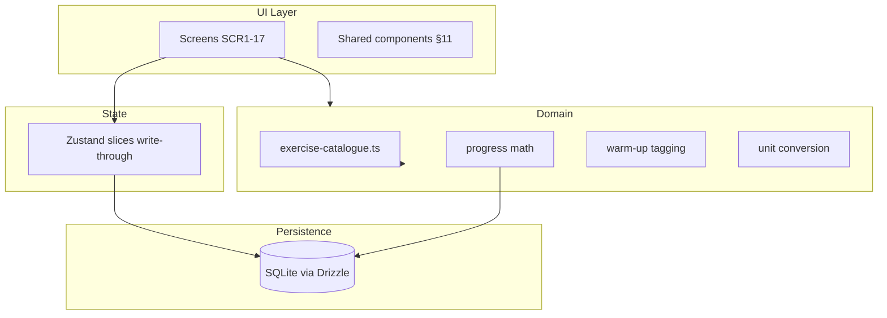
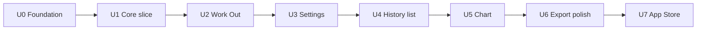

# feat: UltraLoad v1 — full app implementation

## Summary

Build **UltraLoad**, a personal offline strength-training app (Expo + TypeScript), from an empty repo through seven implementation stages aligned to the approved [application blueprint](docs/blueprint.md). Each stage ends with a **device checkpoint** compared to Figma. Shared UI (bottom sheet, sliders, log rows) is built once in Stage 0–1 and reused across Work Out and History. **Stage 7** is App Store release (tooling only — no new product features).

---

## Problem Frame

The blueprint is approved and complete (18/18 sections). The repo has spec artifacts only — no application code yet. This plan turns blueprint §18's staged roadmap into concrete implementation units an agent or developer can execute sequentially with clear done-when criteria.

---

## Requirements

| ID | Requirement | Blueprint trace |
|----|-------------|-----------------|
| R1 | Expo + TypeScript app runs on iOS and Android (Expo Go early; dev build for native modules) | §9, Stage 0 |
| R2 | SQLite (Drizzle) persists profile, plan, workouts; Zustand write-through cache | §7, §9 |
| R3 | Editable catalogue seed module drives all exercise metadata (BR28–BR31) | §5–6, §9 |
| R4 | Work Out home shell; History/Settings via options menu + stack | §4, §12 |
| R5 | Onboarding: splash → bodyweight → exercise picker → rest → warm-up → Work Out | FL1, F2 |
| R6 | Notepad logging: Add Set sheet, record/edit/delete, warm-up rules | FL2–3, F1, F4, BR4–5, BR27 |
| R7 | Rest timer (optional, 3s–5min, background notification on dev build) | FL4, F5, BR20 |
| R8 | Settings hub: bodyweight, plan edit, warm-up, per-exercise overrides, units | FL8, FL12, F10–11 |
| R9 | History list + session detail + edit with progress math | FL5–6, F6–7, F9, BR6–12 |
| R10 | History chart with exercise/muscle-group filters and time ranges | FL7, F8, BR13, BR23 |
| R11 | Export/import JSON round-trip; reset wipes and replays onboarding | FL9–11, F12–14, T22–T24 |
| R12 | UI matches Figma 1:1 (tokens via Figma MCP at Stage 0) | §10–13 |
| R13 | Progress math unit tests (T1–T26 per blueprint §17) | §17 |
| R14 | No analytics, no network, local-only security posture | §15–16 |
| R15 | iOS App Store production release (EAS Build + Submit; normal installable app, not sideload) | §9, §18 Stage 7 |

---

## Key Technical Decisions

| Decision | Rationale |
|----------|-----------|
| **Expo managed workflow + dev client** | Blueprint §9; Expo Go for early UI; dev build when charts/notifications need native modules |
| **React Navigation (not Expo Router)** | Blueprint specifies React Navigation; native stack only (no bottom tabs) |
| **Drizzle + expo-sqlite** | Typed schema, migrations, single source of truth (§7) |
| **Zustand write-through slices** | profile, plan, today, settings persisted; timer + sheet draft transient (§7) |
| **`src/data/exercise-catalogue.ts` single seed file** | BR28–31; all pickers/sliders/charts read catalogue by id |
| **Domain logic in `src/domain/`** | Progress math, warm-up tagging, unit conversion, range derivation — testable without UI |
| **react-native-gifted-charts** | Blueprint §9; Expo-compatible charting |
| **Figma MCP at Stage 0** | Pull exact tokens/component states; no invented colors/spacing (§10 build-time contract) |
| **Jest for domain unit tests** | T1–T26; no E2E framework in v1 — device checkpoints are manual per stage |
| **EAS Build + EAS Submit (U7)** | Blueprint §9 Stage 7; production iOS binary → App Store; learn full release process while solo-user |

---

## High-Level Technical Design



**Data flow (set logging):** User → Add Set sheet (transient draft) → validate against catalogue → write Set to SQLite → hydrate `todaySlice` → UI re-renders grouped by exercise.

**Catalogue consumption:** Every picker, slider bound, warm-up rule, and chart muscle-group calculation resolves `exerciseId` → catalogue entry. Deprecated entries excluded from pickers (BR30); orphaned ids get fallback label (BR31).

---

## Output Structure

```text
ultraload/
├── app.json / app.config.ts
├── package.json
├── src/
│   ├── data/
│   │   └── exercise-catalogue.ts      # BR28–31 seed data (v1 table from blueprint §6)
│   ├── db/
│   │   ├── schema.ts                  # Drizzle tables E1–E7
│   │   ├── client.ts
│   │   └── migrations/
│   ├── domain/
│   │   ├── progress.ts                # BR6–13, BR8–9
│   │   ├── warmup.ts                  # BR4–5, BR15, BR27
│   │   ├── ranges.ts                  # BR14–15, BR19, BR25
│   │   ├── units.ts                   # BR17
│   │   └── catalogue.ts               # lookup, deprecated filter, orphan fallback
│   ├── stores/
│   │   ├── profileSlice.ts
│   │   ├── planSlice.ts
│   │   ├── todaySlice.ts
│   │   ├── settingsSlice.ts
│   │   └── timerSlice.ts
│   ├── components/                    # mapped from Figma v1-components
│   ├── navigation/
│   │   └── RootNavigator.tsx
│   ├── screens/
│   ├── theme/                         # tokens from Figma MCP
│   └── utils/
├── __tests__/domain/                  # T1–T26
└── docs/
    ├── blueprint.md
    ├── blueprint-status.yaml
    └── ultraload-v1-implementation-plan.md
```

---

## Scope Boundaries

**In scope:** Everything in blueprint MVP (F1–F15), Stages 0–7, T1–T26 domain tests, **iOS App Store release (U7)**.

**Deferred to follow-up work:**
- Full accessibility audit (VoiceOver, contrast) — out of v1 per §10
- Cloud sync / multi-user
- Google Play (optional; Android may stay APK sideload until decided)
- 8RM, rep-budget, stall detection
- Id-migration tooling if catalogue ids must be renamed (BR29)
- E2E automated UI tests

**Non-goals:** Female strength standards; per-exercise rest timers; exercise renaming in-app.

---

## Risks & Dependencies

| Risk | Mitigation |
|------|------------|
| Figma token drift | Stage 0 + Stage 1 design gate; block Stage 2 until checkpoint passes |
| iOS import/share quirks | Validate export/import on device in Stage 6 |
| Background rest timer on iOS | Defer notification validation to dev build (Stage 2 done-when) |
| App Review rejection | Offline-only, no login/analytics — low risk; address metadata or reviewer notes and resubmit |
| Apple Developer / EAS setup friction | Stage 7 is explicitly for learning the process; follow Expo EAS Submit docs |
| Chart library limitations | Hand-check muscle-group calcs (T4) against blueprint worked example |
| Catalogue edits break history | BR29–31 enforced in seed schema + T25–T26 |

**External dependencies:** Figma file (ultraload-v1 + v1-components), Expo SDK, dev build for notifications, **Apple Developer Program** (U7), **EAS** (U7).

---

## Implementation Units

### U0. Foundation + design system (Stage 0)

**Goal:** Runnable app shell with persistence, catalogue, theme, and core shared components.

**Requirements:** R1–R4, R12 (partial), R14

**Dependencies:** None

**Files:**
- `package.json`, `app.config.ts`, `tsconfig.json`
- `src/db/schema.ts`, `src/db/client.ts`, `src/db/migrations/`
- `src/data/exercise-catalogue.ts`
- `src/domain/catalogue.ts`
- `src/navigation/RootNavigator.tsx`
- `src/theme/tokens.ts`, `src/theme/typography.ts`
- `src/components/` — options menu, session title bar, buttons, sliders, toggle, log row, bottom sheet shell
- `src/stores/*.ts` (skeleton write-through wiring)
- `src/components/OptionsMenuDropdown.tsx`, `useHomepageOptionsMenu.tsx`, `SessionTitleBar.tsx`

**Approach:**
1. `npx create-expo-app` with TypeScript template; add Drizzle, Zustand, React Navigation, expo-sqlite.
2. Port all 22 exercises + multipliers from blueprint §6 into `exercise-catalogue.ts` with stable ids and `deprecated?: boolean`.
3. Define Drizzle schema for Profile, WorkoutPlan, Workout, LoggedExercise, Set, Settings overrides.
4. Pull Figma variables via MCP → `src/theme/tokens.ts`; load Geist font.
5. Build 3–5 core components; render on device in a smoke screen.

**Test scenarios:**
- `src/domain/catalogue.test.ts`: lookup by id; deprecated excluded from `getSelectableExercises()`; orphan fallback label (T25, T26 partial)
- Test expectation: none for pure theme/scaffold components

**Verification:**
- App opens to Work Out home screen on device (Expo Go)
- Restart app → profile row persists in SQLite
- Edit catalogue display name → picker label updates without UI file changes
- 3–5 components match Figma spacing/type/color (visual checkpoint)

---

### U1. Core loop slice — design gate (Stage 1)

**Goal:** First-launch onboarding + log one set on Work Out main page.

**Requirements:** R5, R6 (record only), R12

**Dependencies:** U0

**Files:**
- `src/screens/SplashScreen.tsx` (SCR1)
- `src/screens/onboarding/*` (SCR2–5)
- `src/screens/WorkOutScreen.tsx` (SCR6)
- `src/components/AddSetSheet.tsx` (SCR7)
- `src/screens/onboarding/ExercisePicker.tsx` (shared with Settings later)
- `src/stores/*` — full onboarding + today write-through

**Approach:**
1. Onboarding flow FL1 with validation (bodyweight required, ≥1 exercise).
2. Work Out empty state per Figma.
3. Add Set sheet: exercise picker (plan only), reps slider, weight slider, warm-up toggle visible.
4. Record Set → creates workout if first of day (BR1) → groups under exercise.
5. **Interim warm-up auto-tag (U1):** when `warmUpAutoTagEnabled` is on — auto-tag when `weight ≤ (warmUpPercent / 100) × lastStandardWeightToday` if today's workout already has a standard set for that exercise; otherwise no auto-tag. Wire `warmUpPercent` from profile; do not use catalogue `warmUpThreshold`.

**Test scenarios:**
- `src/domain/warmup.test.ts`: auto-tags at/below percent of today's last standard set; no auto-tag before first standard set today
- `__tests__/domain/day-record.test.ts`: first set creates one workout per calendar day (T10)

**Verification (design gate — do not proceed to U2 until passed):**
- Fresh install → complete onboarding → log one set → appears under correct exercise
- Compare splash, one onboarding step, Work Out main, Add Set sheet to Figma on device
- Log standard bench set (e.g. 100 kg) → open Add Set again → 45 kg auto-tags warm-up at 50%
- First set of the day for an exercise does not auto-tag as warm-up

---

### U2. Work Out complete (Stage 2)

**Goal:** Full Work Out screen — edit, delete, warm-up auto-tag, rest timer.

**Requirements:** R6, R7, R12

**Dependencies:** U1

**Files:**
- `src/components/AddSetSheet.tsx` — edit mode (tap log row, FL3)
- `src/components/DeleteConfirmOverlay.tsx` (SCR8)
- `src/components/RestTimer.tsx` (SCR9)
- `src/domain/warmup.ts`, `src/domain/ranges.ts`
- `src/stores/timerSlice.ts`

**Approach:**
1. Tap logged set row → sheet in edit mode; delete → confirmation overlay.
2. Replace U1 today-only reference with **full BR15** history lookup: scan all workout history (standard sets only), prefer heaviest weight at 6 reps, else 7, 8, 9, …; threshold = `warmUpPercent / 100 × referenceWeight`. Remove `warmUpThreshold` from `exercise-catalogue.ts`. BR5, BR27 one-set override and global toggle remain.
3. Default reps/weight from last set today (BR21).
4. Rest timer user-triggered; wire expo-notifications on dev build.
5. Revisit WarmUpStep accordion copy to match full history-based rule.

**Test scenarios:**
- `warmup.test.ts`: full BR15 6→7→8 rep cascade (T15); override one set only (T12); global off (T23); warm-up excluded from totals (T1 partial)

**Verification:**
- Full Work Out Figma inventory on device
- Warm-up sets excluded from any totals on Work Out screen
- Rest timer foreground OK; background notification on dev build

---

### U3. Settings (Stage 3)

**Goal:** Settings hub + plan editing + units + per-exercise overrides.

**Requirements:** R8, R12

**Dependencies:** U2

**Files:**
- `src/screens/SettingsScreen.tsx` (SCR14)
- `src/screens/AddExercisesScreen.tsx` (SCR15)
- `src/domain/units.ts`
- `src/stores/settingsSlice.ts`, `src/stores/profileSlice.ts`

**Approach:**
1. Settings hub sections per blueprint §4.
3. Plan remove/toggle-off is instant hide (FL8); past sets kept (BR3); no confirm sheet.
4. Per-exercise overrides (BR29).
5. Unit toggle kg/lbs/stone uniform display (BR17).

**Test scenarios:**
- `units.test.ts`: conversion rounds to 0.5 (T7)
- `catalogue.test.ts`: deprecated not in picker (T25)

**Verification:**
- Add/remove plan exercises updates pickers
- Units apply uniformly across app

---

### U4. History list + progress math (Stage 4)

**Goal:** History list, session detail, edit past sessions, full progress math with unit tests.

**Requirements:** R9, R13

**Dependencies:** U3

**Files:**
- `src/domain/progress.ts`
- `__tests__/domain/progress.test.ts` (T1–T3, T5–T6, T13–T14)
- `src/screens/HistoryListScreen.tsx` (SCR10)
- `src/screens/SessionDetailScreen.tsx` (SCR12–13)
- `src/components/HistoryNavigation.tsx`

**Approach:**
1. Implement all progress rules BR6–BR12; equal-weight day % (BR9).
2. History list rows: day total + day % or "—".
3. Session detail read-only + edit mode reusing Add Set sheet.
4. Edit past day recalculates downstream % (BR12).
5. Plan-removed exercises hidden; re-enable restores (BR3).

**Test scenarios (progress.test.ts):**
- T1 warm-up-only days
- T2 missing prior → "—"
- T3 day-% averaging
- T5 re-enable after remove
- T6 edit past day recalc
- T13 day-total aggregation
- T14 range derivation

**Verification:**
- Log several varied days → list totals + % correct
- Edit past set → list updates
- All domain tests green

---

### U5. History chart (Stage 5)

**Goal:** Chart view with filters, muscle-group weighting, time ranges.

**Requirements:** R10, R13

**Dependencies:** U4

**Files:**
- `src/screens/HistoryChartScreen.tsx` (SCR11)
- `src/components/ChartFilters.tsx`
- `src/domain/progress.ts` — muscle-group weighting (BR13)
- `__tests__/domain/progress.test.ts` — T4, T20

**Approach:**
1. Integrate react-native-gifted-charts.
2. Default Y = session total; filter by exercise or muscle group.
3. Time ranges month/year/all-time; horizontal scroll; 10 latest visible.
4. Shared History empty state.

**Test scenarios:**
- T4: Glutes filter = 7000 worked example
- T20: filter set limited to 5 muscle groups

**Verification:**
- Chart renders real data; hand-checked filter values match
- Matches Figma on device

---

### U6. Export, import, reset, polish (Stage 6)

**Goal:** Data portability, reset, final platform pass.

**Requirements:** R11, R14

**Dependencies:** U5

**Files:**
- `src/domain/export.ts`, `src/domain/import.ts`
- `src/components/ExportOverlay.tsx` (SCR16)
- `src/components/ResetOverlay.tsx` (SCR17)
- `__tests__/domain/export-import.test.ts` (T22, T24)
- `__tests__/domain/reset.test.ts` (T21)

**Approach:**
1. Export JSON per blueprint §18 schema (profile, settings, plan, workouts).
2. Import: validate schemaVersion + catalogue ids → confirm overwrite → hydrate.
3. Reset: full wipe → onboarding replay (Settings overlay, SCR17 — canonical ship surface).
4. Final iOS + Android device pass.

**Note:** If **Reset** appears on the Work Out options menu during development, treat it as a dev convenience only — not shipping UI. Remove it in **U7** before the production App Store compile (reset remains on Settings).

**Test scenarios:**
- T22: export → import round-trip preserves all fields
- T24: malformed / bad version / unknown id rejected
- T21: reset clears and replays onboarding

**Verification:**
- Export → reset → re-import restores all data
- Reset returns to first-launch onboarding
- No blocking issues on target devices

---

### U7. App Store release — iOS (Stage 7)

**Goal:** Ship UltraLoad to the **public App Store** as a normal installable app. Solo-user product, but through Apple's full release flow — **no new in-app features**.

**Requirements:** R15, R14

**Dependencies:** U6 (feature-complete build)

**Files (tooling & metadata — not app logic):**
- `eas.json` — build profiles (`development`, `preview`, `production`)
- `app.config.ts` — verify `bundleIdentifier`, version, icon (likely already set)
- App Store Connect — app record, screenshots, description, privacy nutrition label
- Optional: simple privacy/support page URL if Apple requires it

**Files (ship prep — small app diff before production compile):**
- `src/components/OptionsMenuDropdown.tsx` — remove `reset` menu item
- `src/components/useHomepageOptionsMenu.tsx` — remove reset handler / dev wipe path
- `src/stores/devAppResetSlice.ts` — remove if only used for homepage reset

**Approach:**
0. **Before production build:** remove **Reset** from the Work Out options menu. Navigation menu is History + Settings only. User-facing reset stays on Settings (U6 / SCR17).
1. Enroll in Apple Developer Program ($99/yr).
2. Link EAS project (replace placeholder `extra.eas.projectId` with real EAS project).
3. Configure production iOS profile; run `eas build --platform ios --profile production`.
4. Create App Store Connect listing; declare **no data collected** (matches §15–16).
5. Complete export-compliance questionnaire (standard HTTPS only / exempt).
6. `eas submit` → App Review → release to App Store.
7. Install from App Store on a clean device; confirm updates work without manual re-sign.

**Test scenarios:** None (release process; no domain logic).

**Verification:**
- Work Out options menu shows **History** and **Settings** only (no Reset)
- App appears on App Store and installs like any other app (not sideload, not dev-client-only)
- App Review approved (or rejection resolved and resubmitted)
- Pablo can reinstall / update without the old 7-day free-Apple-ID re-sign cycle

**Note:** U0–U6 continue to use Expo Go / dev client as today. U7 is the first time production store binaries matter.

---

## Open Questions (deferred to implementation)

- Exact reps slider min/max/step (BR22) — match Figma during U1
- Calendar-day timezone edge (BR1) — device local, default implementation
- Rest timer: notification vs Live Activity wording — match platform capability in U2 dev build
- Per-exercise Settings navigation UI — follow Figma during U3
- Privacy / support URL for App Store — resolve during U7 if Apple requires
- Google Play vs APK-only on Android — decide at or after U7

---

## Sources & Research

- **Origin:** [docs/blueprint.md](docs/blueprint.md) (approved 2026-06-22)
- **Human summary:** [taxonomy.md](taxonomy.md)
- **Design:** Figma ultraload-v1 + v1-components (links in blueprint frontmatter)
- **Local codebase:** Greenfield — no prior patterns

---

## Execution Order



**Start with U0.** Do not skip the U1 design gate. **U7** runs after U6 when the app is feature-complete.
